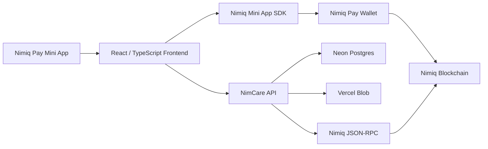

````markdown
# NimCare 💌

> **Send a moment, not just money.**

**NimCare is a Nimiq Pay Mini App that turns a NIM payment into a meaningful digital surprise.**

Instead of sending someone a contextless crypto transaction, NimCare lets you create a **CareDrop** — a photo, playlist, movie-night moment, note, or small gift with NIM attached.

The recipient opens a private link, authenticates with their Nimiq wallet, reveals the surprise, responds, and the exchange becomes part of a private shared **Loop** between both wallets.

**Built for the Nimiq Mini Apps Competition — Cycle II.**

---

## Live links

| | |
|---|---|
| **Live Mini App** | https://nimcare-app.vercel.app |
| **Demo video** | https://youtu.be/GR5fsD2Co-Q?si=sLL4w5Svs6A08fD6 |
| **Submission PR** | https://github.com/nimiq/miniappscompetition-submissions/pull/265 |
| **X / Twitter** | https://x.com/0x_beni_/status/2101091046381801901?s=20 |
| **Skool post** | https://www.skool.com/miniappscompetition/i-built-nimcare-for-nimiq-mini-apps-competition?p=1c494c1c |
| **API health** | https://nimcare-api.vercel.app/api/health |

---

# The idea

Sending someone money is useful.

But it rarely feels personal.

A bank transfer says:

> **0.5 NIM sent.**

A real gesture says:

> **“I saw this and thought of you.”**

NimCare combines those two experiences.

A **CareDrop** can contain:

- a photo and personal note
- a song or playlist that reminded you of someone
- a movie-night surprise
- a small NIM gift
- a simple “this made me think of you” moment

The blockchain handles the value.

**NimCare gives that value emotional context.**

---

# The Critical Demo Path

The core product intentionally stays simple:

### Sender

**Open NimCare**
→ connect Nimiq Pay wallet  
→ choose a CareDrop  
→ add media or a note  
→ enter the recipient wallet  
→ attach NIM  
→ approve the real transaction in Nimiq Pay  
→ share the private CareDrop link

### Recipient

**Open the private link**
→ authenticate with Nimiq Pay  
→ see **“A CareDrop found you”**  
→ open the surprise  
→ see the photo / playlist / movie moment + NIM gift  
→ respond  
→ optionally **Send one back**

### Together

Every successful exchange automatically becomes part of a shared private **Loop**.

There is no:

- relationship request
- “friend acceptance”
- account registration
- username/password flow
- prerequisite pairing ceremony

The relationship emerges from the exchange itself.

---

# Why Nimiq?

Nimiq is not a bolt-on payment button in NimCare.

It is the trust and identity layer that makes the product work.

| Nimiq capability | How NimCare uses it |
|---|---|
| `listAccounts()` | Wallet-native identity |
| `sign()` | Cryptographic login / wallet ownership proof |
| `sendBasicTransactionWithData()` | Real NIM payment with a CareDrop-specific on-chain reference |
| Nimiq JSON-RPC | Independent server-side verification |
| Nimiq Pay | Native transaction approval and Mini App experience |
| NIM | The value attached to each CareDrop |

The backend never accepts:

> “The frontend says the payment worked.”

Instead, it independently checks the blockchain before treating a CareDrop as delivered.

---

# Real transaction verification

Every CareDrop receives a short reference such as:

```text
NC:D:a1b2c3d4e5
````

That reference is attached to the NIM transaction.

After Nimiq Pay returns a transaction hash, NimCare's backend checks:

```text
transaction exists
        ↓
correct sender
        ↓
correct recipient
        ↓
correct NIM amount
        ↓
correct CareDrop reference
        ↓
correct network
        ↓
transaction hash has not already funded another CareDrop
        ↓
DELIVERED
```

A client-side success message alone is never sufficient.

This protects NimCare from fake transaction submissions and payment replay.

---

# Wallet-native authentication

NimCare does not use email/password authentication.

A user signs a domain-bound nonce with their Nimiq wallet.

The server then verifies the signature using `@nimiq/core`.

```text
Nimiq Pay wallet
      │
      ▼
listAccounts()
      │
      ▼
server nonce
      │
      ▼
wallet sign()
      │
      ▼
server verifies signature + public key + address
      │
      ▼
NimCare session
```

The user's:

* private key
* seed phrase
* recovery words

never leave Nimiq Pay and are never requested by NimCare.

---

# Surprise-first architecture

An earlier version of NimCare required two users to pair before sending anything.

That created exactly the wrong feeling for this product.

A surprise should not begin with:

> “Please accept my relationship invite.”

So NimCare was redesigned around a **surprise-first flow**.

The sender can enter any valid Nimiq recipient address — even if the recipient has never opened NimCare before.

Internally, NimCare can safely recognize that wallet address without treating it as authenticated.

Only a real wallet signature can create an authenticated session.

That distinction lets the product support:

**send first → recipient discovers NimCare later**

without weakening authentication.

---

# CareDrops

## 📷 I was thinking of you

Send a photo, a personal note, and some NIM.

Example:

> I saw this today and thought of you.

---

## 🎵 This made me think of you

Share a Spotify, Apple Music, or YouTube link with a message and NIM attached.

The music itself is not downloaded or re-hosted by NimCare.

---

## 🎬 Movie on me

Send a small NIM gift intended for movie night alongside a title, link, or personal message.

NimCare does not pretend to purchase cinema tickets or fabricate integrations that do not exist.

---

# Loops

A **Loop** is the private history between two wallets.

The first successful CareDrop automatically creates the Loop.

Future CareDrops between the same two wallets reuse it.

```text
You
 │
 ├── Photo CareDrop
 │
 ├── Playlist CareDrop
 │
 ├── Movie-night CareDrop
 │
 └── ...
 │
 ▼
Shared Loop
```

This turns NimCare from a one-off payment interaction into something users can return to.

---

# Architecture



### Frontend

```text
app/
```

* React
* TypeScript
* Vite
* `@nimiq/mini-app-sdk`
* mobile-first consumer UI
* hosted on Vercel

### Backend

```text
server/
```

* Express
* TypeScript
* Neon Postgres
* Vercel Functions
* Vercel Blob
* `@nimiq/core`
* Nimiq JSON-RPC verification

---

# CareDrop lifecycle

```text
DRAFT
  ↓
AWAITING_PAYMENT
  ↓
PAYMENT_SUBMITTED
  ↓
PAYMENT_VERIFIED
  ↓
DELIVERED
  ↓
COMPLETED
```

A transaction failure never silently becomes success.

If blockchain verification is unavailable, NimCare leaves the CareDrop pending rather than fabricating a verified state.

---

# Privacy and security

NimCare is designed around private interactions between known people.

### NimCare never requests

* seed phrases
* private keys
* recovery words

### Sensitive content is not written on-chain

The blockchain receives only a minimal CareDrop reference.

Photos, captions, responses, and other private content remain off-chain.

### Access control

A shared CareDrop link alone is not enough to read private content.

The viewer must authenticate as either:

* the sender, or
* the intended recipient wallet

A different authenticated wallet receives an authorization failure.

### Additional protections

* cryptographic wallet authentication
* expiring nonces
* nonce replay prevention
* hashed session tokens
* transaction hash uniqueness
* sender/recipient/amount/reference verification
* file type validation
* CareDrop state-machine enforcement
* server-side authorization
* CORS restrictions

See [`PRIVACY.md`](./PRIVACY.md) for the full disclosure.

---

# Reliability and testing

NimCare was tested beyond the happy path.

Current backend suite:

```text
36 / 36 tests passing
```

Coverage includes:

* real Nimiq signature verification
* invalid signatures
* expired/replayed nonces
* canonical Nimiq address validation
* self-send rejection
* first-time recipients
* recipient authorization
* malicious / invalid requests
* CareDrop creation
* Loop creation and reuse
* NIM/Luna conversions
* transaction reference verification
* incorrect sender
* incorrect recipient
* incorrect amount
* incorrect reference
* transaction hash replay
* RPC unavailable behavior

Real-device debugging also verified inside Nimiq Pay that:

* wallet connection works
* wallet authentication works
* Nimiq consensus is established
* `sendBasicTransaction()` returns a real transaction hash
* `sendBasicTransactionWithData()` returns a real transaction hash
* the exact NimCare `NC:D:<reference>` transaction format works

During real-device testing, a production-only first-time-recipient bug was also discovered and fixed:

the original database schema expected a recipient wallet to already exist in NimCare before a Loop could be created.

That contradicted NimCare's surprise-first model.

The fix now safely creates a non-authenticated wallet record for previously unseen addresses while preserving the requirement for a real cryptographic signature before that wallet can access anything.

---

# Current production network

The production backend currently expects:

```text
Nimiq Mainnet
networkId: 24
```

The configured RPC is used to independently verify submitted transactions.

---

# What NimCare deliberately does NOT do

Hackathon products become fragile very quickly when everything gets added.

NimCare intentionally does **not** include:

* NFTs
* custom smart contracts
* escrow
* staking
* AI relationship coaching
* dating/discovery
* public social feeds
* group gifting
* video calling
* fake ticket purchasing
* fake Cashlink functionality

The goal was to build one coherent experience well:

> **Connect → Send → Verify → Reveal → Respond → Remember**

---

# Running locally

## Requirements

* Node.js 22+
* npm
* Postgres database
* Nimiq RPC endpoint

Clone:

```bash
git clone https://github.com/Benita2001/NimCare.git
cd NimCare
```

### Backend

```bash
cd server
npm install
cp .env.example .env
npm run dev
```

### Frontend

In another terminal:

```bash
cd app
npm install
cp .env.example .env
npm run dev
```

Frontend:

```text
http://localhost:5173
```

API:

```text
http://localhost:8787
```

---

# Environment variables

See:

```text
app/.env.example
server/.env.example
```

Production credentials are never committed to the repository.

Important backend configuration includes:

```text
DATABASE_URL
NIMIQ_RPC_URL
NIMIQ_NETWORK_ID
APP_ORIGIN
ALLOWED_ORIGINS
BLOB_READ_WRITE_TOKEN
```

---

# Repository map

```text
NimCare/
├── app/                  # Nimiq Pay Mini App
│   └── src/
│       ├── screens/      # Main product flows
│       ├── nimiq/        # Mini App provider integration
│       └── components/   # UI and illustrations
│
├── server/
│   └── src/
│       ├── routes/       # API routes
│       ├── services/     # Auth, blockchain verification, wallet logic
│       └── db/           # Postgres schema / persistence
│
├── PRD.md                # Product requirements
├── TRD.md                # Technical design
├── PROJECT_PLAN.md       # Build plan / scope decisions
├── JUDGES.md             # Judge-oriented evidence map
├── PRIVACY.md            # Privacy disclosure
├── MEMORY.md             # Engineering decisions / evidence trail
├── TASKS.md              # Execution history
└── LICENSE               # MIT
```

---

# For judges

If you only have a few minutes:

### 1. Understand the product

> **NimCare turns a NIM payment into a private digital surprise between two people.**

### 2. Watch the demo

[https://youtu.be/GR5fsD2Co-Q?si=sLL4w5Svs6A08fD6](https://youtu.be/GR5fsD2Co-Q?si=sLL4w5Svs6A08fD6)

### 3. Open the live Mini App

[https://nimcare-app.vercel.app](https://nimcare-app.vercel.app)

### 4. Look at the Nimiq integration

Key files:

```text
app/src/nimiq/provider.ts
server/src/services/nimiqSignedMessage.ts
server/src/services/verifyTransaction.ts
server/src/routes/caredrops.ts
```

### 5. Inspect the evidence

```bash
cd server
npm test
```

Current result:

```text
36 / 36 passing
```

---

# Builder story

I built NimCare around a simple idea:

**sending someone money can be useful, but it rarely feels personal.**

I wanted a payment to feel more like a gesture between people than a transaction receipt.

So NimCare turns NIM into a CareDrop — something that can carry a photo, a playlist, a movie-night moment, a note, and a small gift at the same time.

The most important product decision was making the technology disappear.

The user should think:

> “I sent someone a moment.”

not:

> “I executed a blockchain transaction.”

Nimiq remains essential underneath: it provides the wallet identity, the payment rail, native approval, and verifiable proof that the gift was actually sent.

That is the balance NimCare is trying to create:

**human on the surface, verifiable underneath.**

---

# Submission

NimCare was submitted to the **Nimiq Mini Apps Competition — Cycle II**.

Submission PR:

[https://github.com/nimiq/miniappscompetition-submissions/pull/265](https://github.com/nimiq/miniappscompetition-submissions/pull/265)

The competition's automated submission checks confirmed:

* valid submission structure
* valid manifest
* valid images
* public repository
* MIT license
* reachable live demo
* public demo video

---

# License

MIT — see [`LICENSE`](./LICENSE).

---

<p align="center">
  <strong>NimCare</strong><br/>
  Send a moment, not just money.
</p>
```
